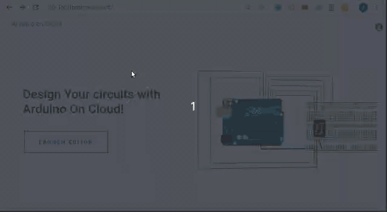
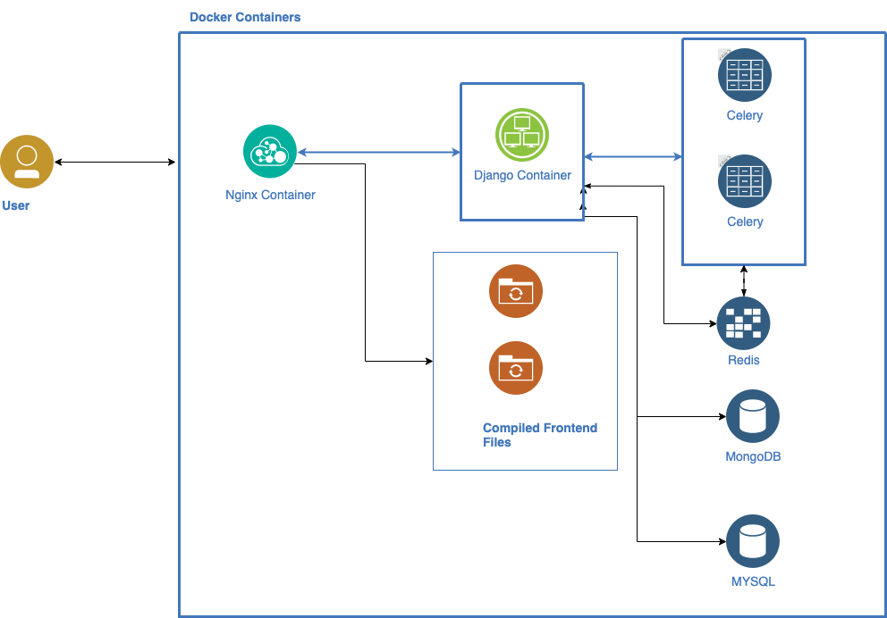

<h1 align="center"> 
eSim and Arduino on Cloud 
</h1>
<h6 align="center"> 

<!-- ALL-CONTRIBUTORS-BADGE:START - Do not remove or modify this section -->
[](#contributors-)
<!-- ALL-CONTRIBUTORS-BADGE:END -->

[](https://esim-cloud.readthedocs.io/en/latest/?badge=latest)
[](https://discord.gg/cZbDD8K)

[](https://www.codefactor.io/repository/github/frg-fossee/esim-cloud)
[](https://img.shields.io/badge/PRs-welcome-important)


[Contributing](#Contributing) | [Credits](#Credits)
</h6>

---

## eSim on Cloud
This system allows the users to draw analog and digital circuits and simulate them. The users have a facility to drag and drop components from the left pane onto the schematic grid on the right pane. The components on the grid are connected using wires. The circuit can then be simulated using the different simulation parameters (DC Solver, DC Sweep, Transient analysis, and AC analysis). The basic ERC check enables the users to find out errors if any. The size of the schematic grid can be changed from A1 to A5 paper sizes along with portrait and landscape modes. The users can also print the circuit or save it in pdf format for documentation purposes. A demo is shown below.


## Arduino on Cloud
This system allows the users to drag and drop Arduino components from the left pane onto the working space on the right. The pins of the Arduino board can be connected to various input/output devices like LED, motor, push button, etc using wires. There is also a facility to change the color of wires, LEDs, and such components, so as to differentiate the easily. The users can then proceed to write their code in the code window which is then simulated. There is an option for the users to print or save it in pdf format for documentation purposes. The basic ERC check enables the users to find out errors if any. A demo is shown below.



## Documentation 

The latest version of documentation for the project is maintained on [esim-cloud.readthedocs.io](https://esim-cloud.readthedocs.io/)

## Installation

### Basic Setup
* [Docker](https://docs.docker.com/get-docker/) and [docker-compose](https://docs.docker.com/compose/install/) will be required for production and development environments. 
* Make sure that you install both of them specific to your OS and version (Linux, Windows, Mac)
* ```git clone https://github.com/frg-fossee/eSim-Cloud.git```
* ```cd eSim-Cloud```

### Production Environment
* Setup env (Change default credentials)
  * ``` cp .env .env.prod ```
* Run docker (in background) 
  * ``` docker-compose -f docker-compose.prod.yml --env-file .env.prod up --scale django=2 --scale celery=3 -d```
  * Note: ```-d``` option will run the process in the background. 
  * Remove ```-d``` to view all logs and process in the terminal.
* Migrations and seed eSim SVGs (after DB and django has finished initializing)
   * ```docker ps```  # Find docker id of django. It would be something like 'c4ac75dd1937'
   * ```docker exec -it ContainerID /bin/bash```
   * ```sh migrations.sh```

### Development Environment
[](https://ssh.cloud.google.com/cloudshell/editor?cloudshell_git_repo=https%3A%2F%2Fgithub.com%2Ffrg-fossee%2FeSim-Cloud&cloudshell_git_branch=develop&cloudshell_print=first_run.dev.sh&cloudshell_tutorial=README.md)

* Build and run migrations (First time only)
  * Pulls the latest dev image from GitHub
  * ``` /bin/bash first_run.dev.sh ``` 
* Run docker
  * ``` docker-compose -f docker-compose.dev.yml --env-file .env up ```  
  * It might take a while to initialize / throw some errors if they're initialized in the wrong order.
  * Running the command again will most likely fix the issue.

### Other useful commands
* These containers are only for dev environment. In production, the compiled files will be served by nginx
* Manually build containers
  * ```docker-compose -f docker-compose.dev.yml --env-file .env build```
* Run backend container only
  * ```docker-compose -f docker-compose.dev.yml --env-file .env up django```
* Run eSim along with backend
  * ``` docker-compose -f docker-compose.dev.yml --env-file .env up eda-frontend ```
* Run Arduino along with backend
  * ``` docker-compose -f docker-compose.dev.yml --env-file .env up arduino-frontend ```
* Restart nginx
  * Dev env: ``` docker-compose -f docker-compose.dev.yml --env-file .env restart nginx```
  * Prod env: ``` docker-compose -f docker-compose.prod.yml --env-file .env.prod restart nginx``` 

### Pulling docker images
* Docker images can be directly pulled from GitHub instead of building on system
```console
   $ echo $GITHUB_TOKEN | docker login docker.pkg.github.com --username [github_username] --password-stdin
   $ docker-compose -f docker-compose.dev.yml pull
   $ docker-compose -f docker-compose.dev.yml up --env-file .env -d db
   ----WAIT FOR DB TO FINISH INITIALIZING-----
   $ docker-compose -f docker-compose.dev.yml --env-file .env up
```

### Ubuntu Installation Dump
* These are all commands being executed to setup the project's development environment on a fresh ubuntu system with username ```ubuntu```
* If you notice ``` ERROR: UnixHTTPConnectionPool(host='localhost', port=None): Read timed out. ``` or ``` Exited with code 137```, it means that docker / host system ran out of memory

```console
   $ git clone https://github.com/frg-fossee/eSim-Cloud/
   $ cd eSim-Cloud/
   $ git checkout develop
   $ sudo curl -L "https://github.com/docker/compose/releases/download/1.25.5/docker-compose-$(uname -s)-$(uname -m)" -o /usr/local/bin/docker-compose
   $ sudo chmod +x /usr/local/bin/docker-compose
   $ sudo apt-get remove docker docker-engine docker.io containerd runc
   $ curl -fsSL https://get.docker.com -o get-docker.sh
   $ sudo sh get-docker.sh
   $ sudo usermod -aG docker ubuntu
   $ sudo systemctl start docker
   $ sudo systemctl status docker
   $ sudo docker ps
   $ sudo ./first_run.dev.sh
```

## Tech stack
* Simulation backend
  * ngspice (eSim)
  * Arduino compiler 
* Middleware
  * Django 
  * REST APIs 
  * Celery 
  * Redis 
* Frontend
  * React
  * mxgraph
  * Angular
  * RaphaelJS
  * AVR8js simulator
* Database
  * MySQL
  * Postgres
  * MongoDB
* Production
  * nginx
  * dockers
* Testing
  * GitHub actions  

## Docker Containers


## Contributing 
Want to contribute? See our [contributing guidelines](CONTRIBUTING.md). Contributions in any form are welcome.

## Contributors ✨

Thanks goes to these wonderful people ([emoji key](https://allcontributors.org/docs/en/emoji-key)):

<!-- ALL-CONTRIBUTORS-LIST:START - Do not remove or modify this section -->
<!-- prettier-ignore-start -->
<!-- markdownlint-disable -->
<table>
  <tr>
    <td align="center"><a href="http://darshkpatel.com"><br /><sub><b>Darsh Patel</b></sub></a><br /><a href="https://github.com/frg-fossee/eSim-Cloud/commits?author=darshkpatel" title="Code">💻</a> <a href="https://github.com/frg-fossee/eSim-Cloud/commits?author=darshkpatel" title="Documentation">📖</a> <a href="#infra-darshkpatel" title="Infrastructure (Hosting, Build-Tools, etc)">🚇</a></td>
    <td align="center"><a href="https://www.linkedin.com/in/darshan-sudake-a640ba1b1/"><br /><sub><b>Darshan Sudake</b></sub></a><br /><a href="https://github.com/frg-fossee/eSim-Cloud/commits?author=dssudake" title="Code">💻</a> <a href="https://github.com/frg-fossee/eSim-Cloud/commits?author=dssudake" title="Documentation">📖</a> <a href="#design-dssudake" title="Design">🎨</a></td>
    <td align="center"><a href="https://felixfaisal.github.io/"><br /><sub><b>felixfaisal</b></sub></a><br /><a href="https://github.com/frg-fossee/eSim-Cloud/commits?author=felixfaisal" title="Code">💻</a> <a href="https://github.com/frg-fossee/eSim-Cloud/commits?author=felixfaisal" title="Documentation">📖</a> <a href="#design-felixfaisal" title="Design">🎨</a></td>
    <td align="center"><a href="https://github.com/rohitgeddam"><br /><sub><b>rohitgeddam</b></sub></a><br /><a href="https://github.com/frg-fossee/eSim-Cloud/commits?author=rohitgeddam" title="Code">💻</a> <a href="https://github.com/frg-fossee/eSim-Cloud/commits?author=rohitgeddam" title="Documentation">📖</a> <a href="#design-rohitgeddam" title="Design">🎨</a></td>
    <td align="center"><a href="http://navonildas.github.io/"><br /><sub><b>Navonil Das</b></sub></a><br /><a href="https://github.com/frg-fossee/eSim-Cloud/commits?author=NavonilDas" title="Code">💻</a> <a href="https://github.com/frg-fossee/eSim-Cloud/commits?author=NavonilDas" title="Documentation">📖</a> <a href="#design-NavonilDas" title="Design">🎨</a></td>
    <td align="center"><a href="https://github.com/meet-10"><br /><sub><b>Meet10</b></sub></a><br /><a href="https://github.com/frg-fossee/eSim-Cloud/commits?author=meet-10" title="Code">💻</a> <a href="https://github.com/frg-fossee/eSim-Cloud/commits?author=meet-10" title="Documentation">📖</a> <a href="#design-meet-10" title="Design">🎨</a></td>
    <td align="center"><a href="https://github.com/gupta-arpit"><br /><sub><b>gupta-arpit</b></sub></a><br /><a href="https://github.com/frg-fossee/eSim-Cloud/commits?author=gupta-arpit" title="Code">💻</a> <a href="#design-gupta-arpit" title="Design">🎨</a></td>
  </tr>
</table>

<!-- markdownlint-restore -->
<!-- prettier-ignore-end -->

<!-- ALL-CONTRIBUTORS-LIST:END -->

This project follows the [all-contributors](https://github.com/all-contributors/all-contributors) specification. Contributions of any kind welcome!
