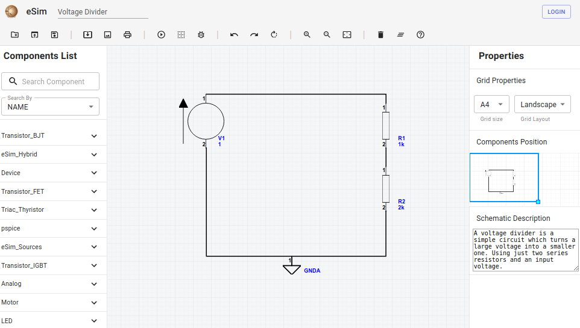
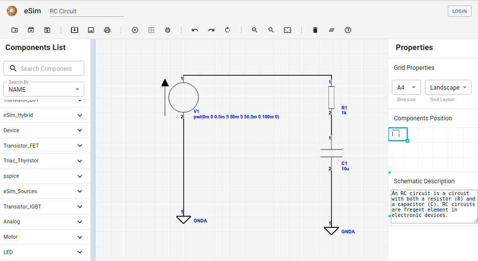
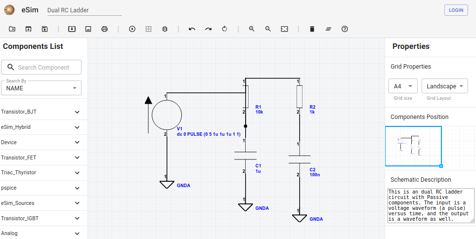
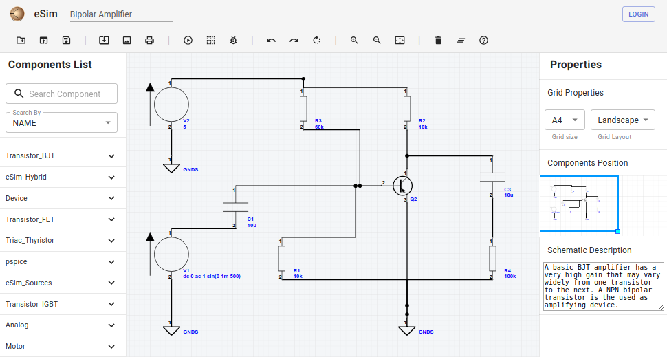
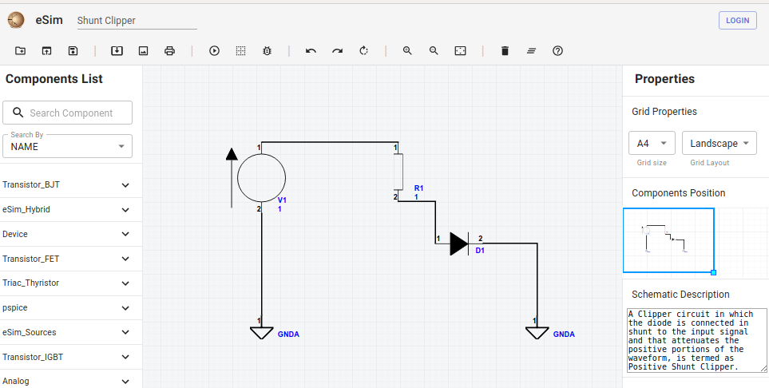
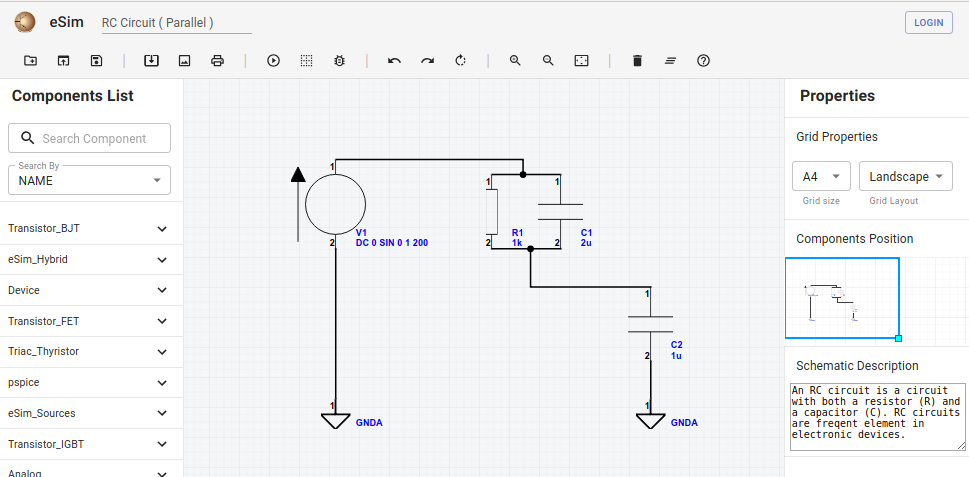

=====================
eSim Gallery Examples
=====================

eSim gallery has 6 example circuits. You can open, re-design, save, and simulate them. These are listed below.

Voltage Divider
###############

* Simulation Type: DC Solver
* Simulation Parameters: None
* Simulation

    .. image:: images/Voltage_Divider_Simulation.png

RC Circuit
##########

* Simulation Type: Transient Analysis
* Simulation Parameters
    * Start Time: 0
    * Stop Time: 100m
    * Step Time: 10m
* Simulation

    .. image:: images/RC_Circuit_Simulation.png

Dual RC Ladder
##############

* Simulation Type: Transient Analysis
* Simulation Parameters
    * Start Time: 0
    * Stop Time: 50m
    * Step Time: 50u
* Simulation

    .. image:: images/Dual_RC_Ladder_Simulation.png

Bipolar Amplifier
#################

* Simulation Type: Transient Analysis
* Simulation Parameters
    * Start Time: 0
    * Stop Time: 10m
    * Step Time: 10u
* Simulation

    .. image:: images/Bipolar_Amplifier_Simulation1.png

* Simulation Type: AC Analysis
* Simulation Parameters
    * Type: Decade
    * Points: 10
    * Start frequency: 10
    * Stop frequency: 10Meg
* Simulation

    .. image:: images/Bipolar_Amplifier_Simulation2.png

Shunt Clipper
#############

* Simulation Type: DC Sweep
* Simulation Parameters
    * Component: V1
    * Start Voltage: 0
    * Stop Voltage: 1
    * Step Voltage: 1m
* Add Expression: -v1#branch
* Simulation

    .. image:: images/Shunt_Clipper_Simulation.png

RC Circuit Parallel
###############

* Simulation Type: Transient Analysis
* Simulation Parameters
    * Start Time: 0
    * Stop Time: 30m
    * Step Time: 10u
* Simulation

    .. image:: images/RC_Circuit_Parallel_Simulation.png

