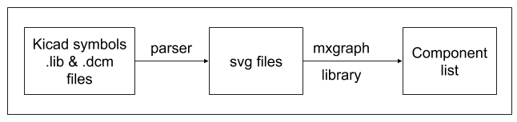
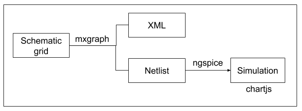

=====================
eSim Development Flow
=====================

Reading Component Symbol Library files and Rendering in the Browser
###################################################################
The Kicad symbol libraries '.lib' and '.dcm' (https://github.com/KiCad/kicad-symbols) are parsed to generate SVG files that are compatible with the mxgraph (javascript graph library). These components are generated only once and are cached. These generated SVG files are read and rendered in the component list (left pane) using mxgraph. 

Generating XML files
####################
The components from the left pane are dropped onto the schematic grid. By default, the size of the grid is A4, which can be changed from A5 to A1. The components connected by wires are converted to XML format using mxgraph, whenever the circuit is saved by the user. This XML is used to save and re-open the saved circuits. This XML is also used to auto annotate the circuit, and in performing ERC checks as well.

Generating Netlist 
##################
Using the mxgraph object, a netlist is generated (compatible with ngspice simulator) when the user clicks on the 'Simulation' or 'generate netlist' button. The simulation parameters are supplied by the user based on the simulation type chosen by the user. The following are the different parts of netlist generation:

* Title: title of the schematic diagram

    .. code::

      RC Circuit

* Model: All spice models given by users will be listed here. These are extra parameters which are not delivered with ngspice. They are device manufacturer specific and may be obtained from their web sites or from other sites

    .. code::

        .model BC546B npn ( IS=7.59E-15 VAF=73.4 .........)

* Netlist: Text description of circuit. It has all components listed with connecting nodes, parameters and spice model (if specified by the user). This is generated with the help of mxgraph object. An example is shown below

    .. code::

        r1  in out 1k
        c1  out gnd 10u
        v1  in gnd pwl(0m 0 0.5m 5 50m 5 50.5m 0 100m 0)
        Q1 intc intb 0 BC546B

* Control Line: It has all simulation parameters. It is generated depending on the type of simulation and the parameters specified by user

    .. code::

        .tran 10e-03 100e-03 0e-03    // Transient analysis
        .ac dec 10 10 1Meg            // AC Analysis

* Control Block: All Interactive commands to actually produce output for given schematic.

    .. code::

        .control
        run
        print all > data.txt
        .endc
        .end

Simulation
##########

* When the 'Simulate' button is clicked, the ERC checks are performed. If all goes well then the netlist is generated. If not, the error(s) are shown to the user. 
* This netlist is sent to the backend services. Using the distributed queueing mechanism of Celery, asynchronous requests (netlist files) are kept in queue and passed onto Ngspice. 
* Ngspice then outputs a text file with all the coordinates required to plot the graph.  
* This textfile is then parsed using an inhouse parser to convert the data of the text file into an organised data structures (``JSON``). The simulation graph is then plotted and rendered based on the data returned by this ``JSON`` using ``chartjs``.

JSON format returned by parser
##############################

As mentioned above, the output produced by ngspice is converted to ``JSON``. The format is given below:

    .. code::

        {
            total_number_of_tables: <int>,
            isGraph: <bool>,
            data:[
                {
                    labels : [ ], x : [ ], y : [ [ ] , [ ] ] ,
                } 
            ]
        }

* total-number-of-tables: The number of tables present.
* isGraph: ``True``, if the data is a graph, ``False`` if the data is just a table.
* data: An array which contains one or more objects depending on the input provided to the parser.
* labels: An array which contains all the labels that have to be present on the graph. Eg. ["time", "vin", "vout"].
* x: An array containing all the ``x`` co-ordinates for a set of graph. E.g. Time on x-axis. This is a linear array as the ``x`` coordinates will be the same for different set of ``y`` coordinates.
* y: A 2D array containing ``y`` co-ordinates for different graphs.
